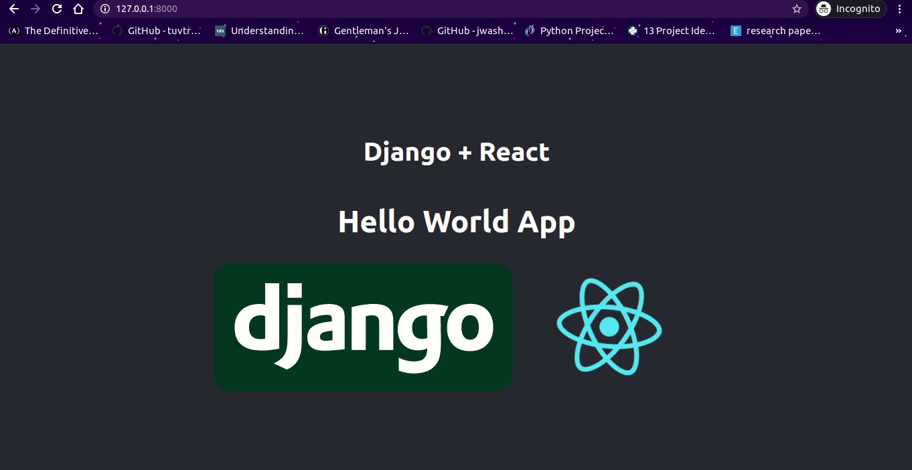

Hello World App using Django and React

How to create this simple app ?

Step 1: Install django

    $ pip install django

Step 2: Install node

    - Download it from here https://nodejs.org/en/download/

Step 3: Create Django App

    $ django-admin startproject backend

Step 4: Install creat-create-app for creating React project

    $ npm install create-react-app

Step 5: Now Create React App

    $ npx create-react-app frontend

Step 6: Now move to frontend folder and open another terminal and run this

    $ npm run build

    Don't close this terminal window this will be used for frontend work.

Step 7: Now Drag frontend and Drop it to backend

Step 8: Open settings.py in backend and edit this

    - 
    TEMPLATES = [
    {
        'BACKEND': 'django.template.backends.django.DjangoTemplates',
        'DIRS': [
            os.path.join(BASE_DIR, 'frontend/build') // Edit this line
        ],
        'APP_DIRS': True,

        ...
    }

    and

    - 
    STATICFILES_DIRS = [
        os.path.join(BASE_DIR, 'frontend/build/static') // Edit this line
    ]

Step 9: Now create URL for our app

    - open urls.py and add TemplateView path

    urlpatterns = [
        path('admin/', admin.site.urls),
        path('', TemplateView.as_view(template_name = 'index.html')) // Add this line
    ]

Step 10: Open App.js in your frontend and Edit your component

    - now after making changes run this command in your frontend terminal window

    $ npm run build

    Note - Whenever you make changes in your frontend code run this command

Step 11: Finally run your django server
    
    $ python manage.py runserver

    - Make sure your in backend dictory while running this command

